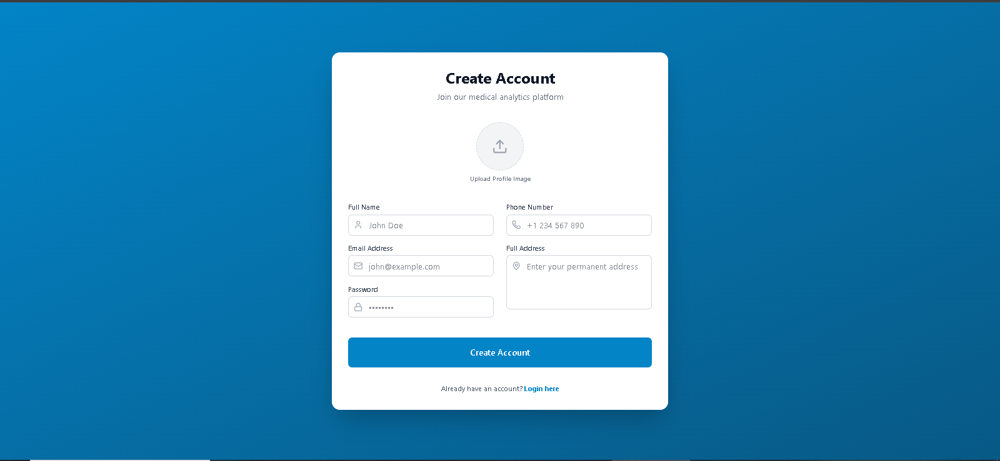
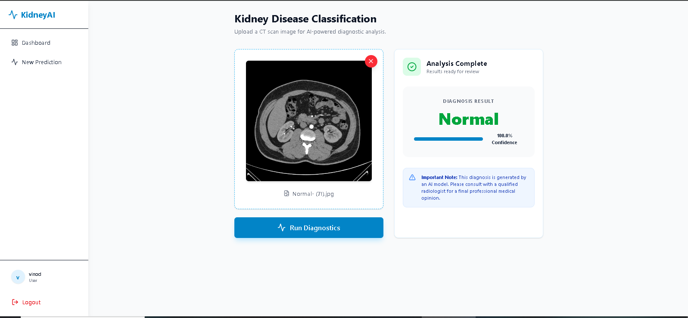

# Kidney Disease Classification Platform

## 🩺 Project Overview
This project is a production-grade medical imaging solution designed to classify Kidney Diseases (Normal vs. Tumor) from CT scan images. It combines a deep learning CNN model with a fully-featured web application, enabling medical professionals to manage patient diagnostics, track history, and analyze system-wide health trends.

---

## ✨ Features
- **User Authentication**: Secure registration and login system with JWT-based sessions.
- **Email Verification**: Automatic OTP delivery for account verification during signup.
- **Diagnostic Engine**: High-accuracy CNN model for classifying Kidney CT scans.
- **Patient Dashboard**: Personalized workspace to view diagnostic history and personal statistics.
- **Admin Control Panel**: System-wide analytics, user management, and global diagnostic distribution.
- **Image Management**: Support for profile image uploads and historical scan storage.
- **Modern UI**: Fully responsive, high-performance interface built with React, Tailwind CSS v4, and Framer Motion.

---

## 🛠️ Tech Stack
- **Backend**: Flask (Python), Flask-SQLAlchemy (MySQL), Flask-JWT-Extended, Flask-Mail.
- **Frontend**: React (Vite), Tailwind CSS v4, Framer Motion, Lucide Icons, Recharts.
- **Deep Learning**: TensorFlow, Keras, NumPy.
- **Database**: MySQL.
- **MLOps**: DVC (Data Version Control).

---

## 📸 Screenshots

### 1. Registration & Authentication


### 2. Patient Dashboard


### 3. AI Diagnostic Analysis


### 4. Admin Personal Workspace


### 5. System Analytics Panel (Admin)


---

## 📂 Project Structure
```text
├── artifacts/              # Trained models and processed data
├── config/                 # Pipeline configuration files
├── frontend/               # React (Vite) frontend application
│   ├── src/
│   │   ├── components/     # Reusable UI components
│   │   ├── context/        # Auth and state management
│   │   └── pages/          # Individual page views
├── model/                  # Model storage (model.h5)
├── src/                    # Backend source code
│   └── cnnClassifier/      # ML logic, Auth handlers, and Utils
├── app.py                  # Main Flask API entry point
├── init_db.py              # Database initialization script
└── requirements.txt        # Python dependencies
```

---

## 🚀 Installation & Setup

### 1. Clone the Repository
```bash
git clone https://github.com/your-username/Kidney-Disease-Classification-DL-Project.git
cd Kidney-Disease-Classification-DL-Project
```

### 2. Backend Setup
Create and activate a virtual environment:
```bash
python -m venv venv
# Windows
venv\Scripts\activate
```

Install Python dependencies:
```bash
pip install -r requirements.txt
```

### 3. Database Initialization
Ensure you have MySQL installed and running. Execute the initialization script to create the database and default admin account:
```bash
python init_db.py
```

### 4. Frontend Setup
Navigate to the frontend directory and install NPM packages:
```bash
cd frontend
npm install
```

---

## 🔑 Environment Variables
Create a `.env` file in the root directory and configure the following variables:

```env
# MySQL Configuration
MYSQL_HOST=localhost
MYSQL_USER=root
MYSQL_PASSWORD=your_mysql_password
MYSQL_DB=kidney_db

# Email Configuration (SMTP)
MAIL_USERNAME=your-email@gmail.com
MAIL_PASSWORD=your-google-app-password

# Security
JWT_SECRET_KEY=your_super_secret_key_here
```

---

## 📖 Usage

### 1. Starting the Platform
- **Run Backend**: `python app.py` (Runs on port 8080)
- **Run Frontend**: `cd frontend && npm run dev` (Runs on port 5173)

### 2. Diagnostic Workflow
1. **Register**: Create an account and verify your email via the OTP sent to your terminal (development) or email (production).
2. **Login**: Access your dashboard.
3. **Analyze**: Navigate to "New Prediction," upload a CT scan image, and click "Run Diagnostics."
4. **History**: View your previous results and confidence scores in your personal Dashboard.

### 3. Admin Access
Log in with the system administrator credentials:
- **Email**: `admin@kidney.com`
- **Password**: `admin123`
Admins can access the **Admin Panel** to view global platform statistics and manage user data.

---

## 🛣️ API Endpoints
- `POST /api/auth/register` - User registration
- `POST /api/auth/login` - User authentication
- `POST /api/predict` - Diagnostic image processing
- `GET /api/user/history` - Fetch personal history
- `GET /api/admin/stats` - Fetch system-wide analytics
